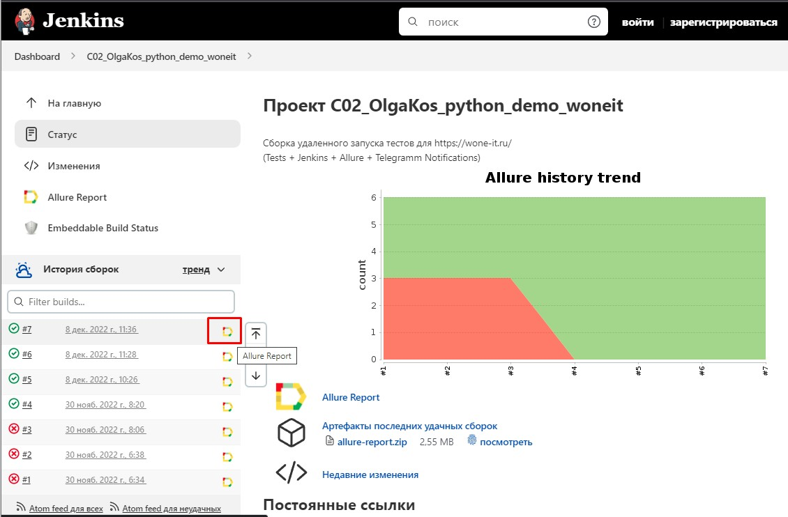
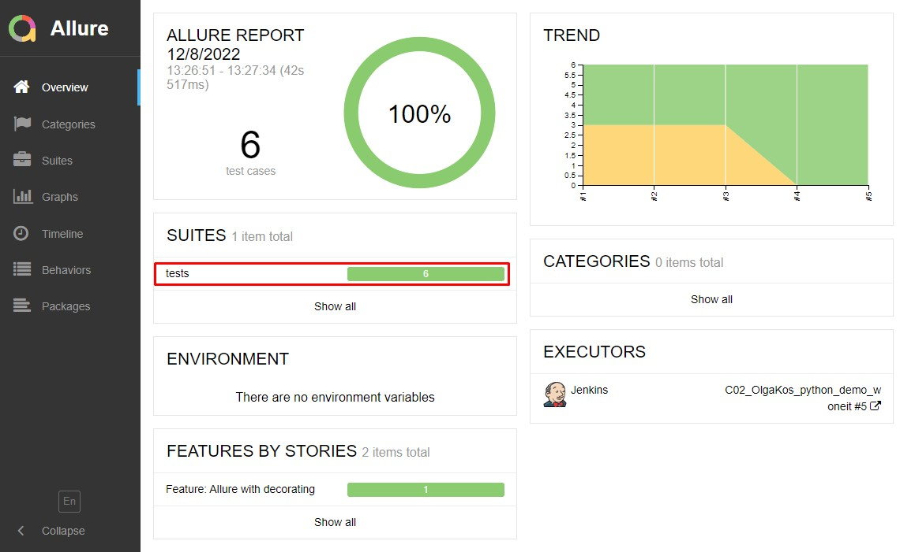
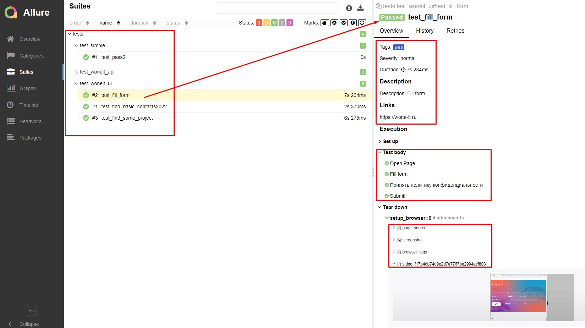
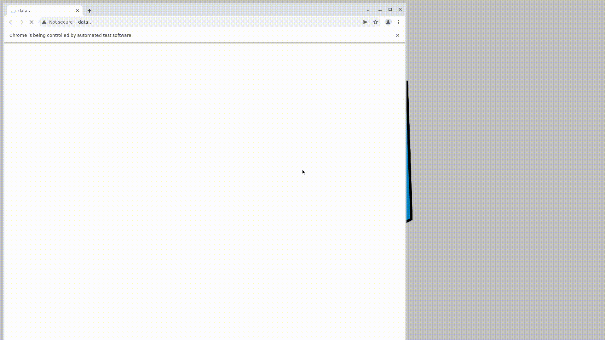
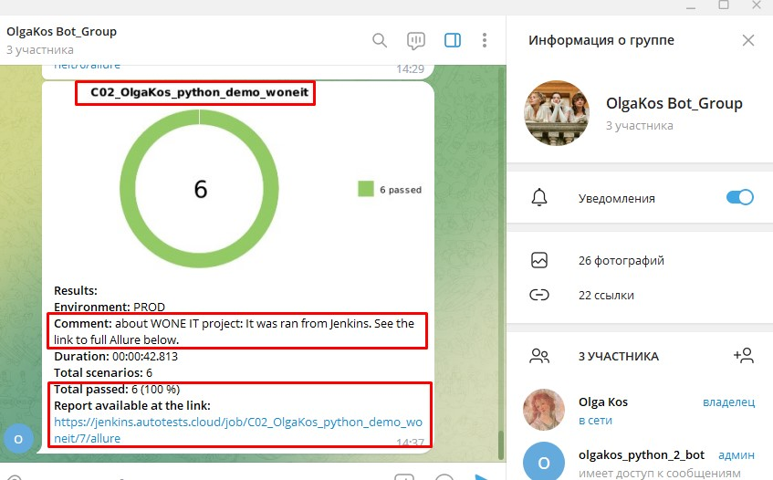

<p align="center">

</p>

## Демо-проект по автоматизации тестирования: WONE IT
:earth_americas: https://wone-it.ru/

## :watermelon: Реализованы следующие проверки:
:white_check_mark: API Статус-код страницы = 200    
:white_check_mark: API Статус-код страницы = 404    
:white_check_mark: UI Проверить актуальность контактов    
:white_check_mark: UI Заполнить регистрационную форму данными    
:white_check_mark: UI Поиск через меню с выпадающим списком

## :watermelon: Локальный запуск моих тестов (из терминала):
1. Скачать проект.
2. Перейти в директорию проекта.
2. Команда:
```
$ pytest .
```
Ожидаемый результат: На консоли выведется отчет о прохождении тестов: успешных и (если есть) упавших.

## :watermelon: Удаленный запуск моих тестов из Jenkins в режиме реального времени. 
Этот способ не требует установки никаких приложений на компьютер пользователя! Работает "как есть" онлайн.

Способ 1. Быстрый вариант, только просмотр:
1. <i>Не зарегистрированным</i> пользователем перейти на страницу сборки проекта по ссылке: 
<a target="_blank" href="https://jenkins.autotests.cloud/job/C02_OlgaKos_python_demo_woneit/">our Jenkins project</a>
2. Слева внизу кликнуть на желтую иконку "Allure Report" и ознакомиться в графическим отчетом о результатах последнего запуска тестов.  
<p align="center">

</p>

Способ 2. Запустить тесты самостоятельно: 
1. <i>Зарегистрированным</i> пользователем перейти на страницу сборки проекта по ссылке: 
   <a target="_blank" href="https://jenkins.autotests.cloud/job/C02_OlgaKos_python_demo_woneit/">our Jenkins project</a>
3. Перечисленные (ниже) параметры можно менять в графическом интерфейсе перед запуском тестов.
4. Запустить выполнение тестов кнопкой "Собрать" (внизу страницы)
5. Дождаться окончания прогона (~2 минуты)
6. Кликнуть на желтую иконку "Allure Report" и получить свежий Allure Report. NB! срок хранения демо-сборки ограничен. Сборка может быть деактвирована ~через 8 недель.  

###### Базовые параметры сборки:
```
clean
test
-Dbrowser=${BROWSER}
-DbrowserVersion=${BROWSER_VERSION}
-DbrowserSize=${BROWSER_SIZE}
-DremoteDriverUrl=https://user1:1234@${REMOTE_BROWSER}/wd/hub/
-DvideoStorage=https://${REMOTE_BROWSER}/video/
```
######  Легенда:
- `BROWSER` – браузер, в котором будут выполняться тесты (по умолчанию - Chrome).
- `BROWSER_VERSION` версия браузера, в которой будут выполняться тесты (по умолчанию - 100.0). <i>В примере другие варианты не заданы.</i>.
- `BROWSER_SIZE` – размер окна браузера, в котором будут выполняться тесты (по умолчанию - 1920x1080).
- `REMOTE_BROWSER` - адрес (логин и пароль) удаленного сервера (Selenoid), на котором будут запускаться тесты. <i>В примере заданы по умолчанию.</i>.
- `THREADS` - кол-во потоков. <i>В примере другие варианты не заданы.</i>.
<br>Дополнительные параметры сборки, задействованные для выгрузки мини-отчета в Telegram:
- `PROJECT_NAME` - название проекта
- `ENVIRONMENT` - тестовый стенд (prod, preprod, stage...), на котором запускались тесты. <i>В примере эти данные не заданы. Можно выставить любое значение из доступных в выпадающем списке</i>.
- `COMMENT` - любой текстовой комментарий
- `BUILD_URL` - автоматическая ссылка на детализированный отчет о сборке

## :bellhop_bell: Allure отчет
Визуальный (графический) отчет с результатами прогон тестовых наборов. 
<br>Способ 1: 
<br>Запросить локальный отчет средствами среды разработки PyCharm. (*) Но в большинстве случаем может потребоваться углубленная настройка локального проекта.
```
$ scoop install allure
```
  
Способ 2:
<br>1. Выполнить сборку в Jenkins
<br>2. Убедиться, что в блоке История сборок (напротив номера #) появился желтый значок Allure Report. (Если сборка запущена, но значок не виден, убедиться, что меню "История сборок" раскрыто)
<br>3. Кликнуть по значку Allure Report
<br>Ожидаемый результат: Откроется страница с графическими схемами Allure Report

###### Главная страница Allure-отчета содержит следующие информационные блоки:
- `ALLURE REPORT` отображает: Дату и время прохождения теста. Общее количество пройденных кейсов. Диаграмму с указанием процента и количества успешных, упавших и сломавшихся в процессе выполнения тестов
- `TREND` - отображает тренд прохождения тестов от сборки к сборке
- `SUITES` - отображает распределение результатов тестов по тестовым наборам
- `ENVIRONMENT` - отображает тестовое окружение (стенд), на котором запускались тесты. <i>В данном демо-примере информация не задана.</i>
- `CATEGORIES` - отображает распределение неуспешно прошедших тестов по видам дефектов
- `FEATURES BY STORIES` - отображает распределение тестов по функционалу, который они проверяют
- `EXECUTORS` - отображает исполнителя текущей сборки (ссылка на сборку в Jenkins)

###### Главный экран отчета (Owerwiev)
<p align="center">

</p>

###### Страница с проведенными тестами (Suites)
<p align="center">

</p>

## :watermelon: Видео прохождения тестов
К каждому тесту (в отчете) прилагается автоматически сгенерированное Selenoid видео. Пример:
<p align="center">
  
</p>

## :bellhop_bell: Отчет в Telegram
После завершения сборки специальный Telegram-бот отправляет сообщение с отчетом о прогоне тестов.
Чтобы видеть эти сообщения, вступите (временно) в телеграмм-группу `OlgaKos Bot_Group`

Пример поста от бота:
<p align="center">

</p>
--------------------------
<br>version 01 - add 5 easy tests
<br>version 02 - add Page Object Pattern
<br>version 03 - add local Allure. Some fix.
<br>version 04 - branch `jenkins_add`. Add Jenkins with remote Allure. New Readme
<br>version 05 - branch `jenkins_add`. Add Telegramm notifications to launch from Jenkins. New Readme
-----------------------
<br>2022-12-08